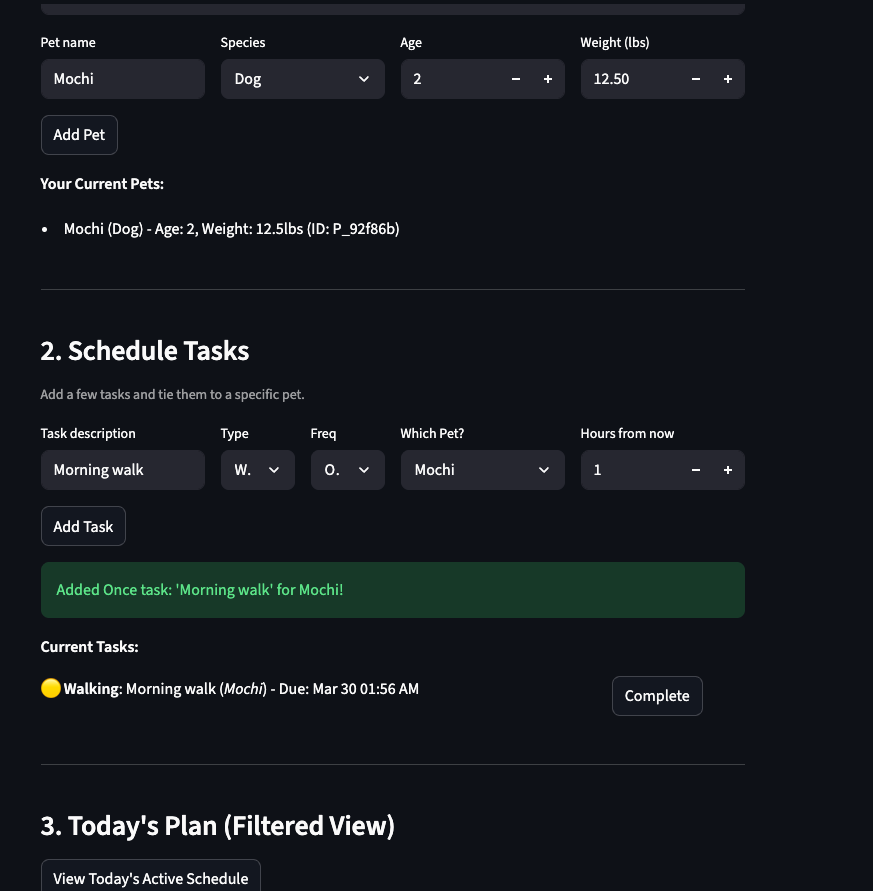

# PawPal+ (Module 2 Project)

You are building **PawPal+**, a Streamlit app that helps a pet owner plan care tasks for their pet.

## Scenario

A busy pet owner needs help staying consistent with pet care. They want an assistant that can:

- Track pet care tasks (walks, feeding, meds, enrichment, grooming, etc.)
- Consider constraints (time available, priority, owner preferences)
- Produce a daily plan and explain why it chose that plan

Your job is to design the system first (UML), then implement the logic in Python, then connect it to the Streamlit UI.

## What you will build

Your final app should:

- Let a user enter basic owner + pet info
- Let a user add/edit tasks (duration + priority at minimum)
- Generate a daily schedule/plan based on constraints and priorities
- Display the plan clearly (and ideally explain the reasoning)
- Include tests for the most important scheduling behaviors

## Smarter Scheduling

The PawPal+ system now includes advanced scheduling algorithms to make pet care even easier:
- **Chronological Sorting**: Tasks and appointments are automatically sorted by their due date/time using Python's `sorted()` function and lambda keys.
- **Smart Filtering**: Custom filters allow the schedule to isolate tasks for a specific pet or by complete/pending statuses instantly. The UI uses this to show a "Priority Active View".
- **Recurring Task Automation**: Checking off daily or weekly tasks doesn't just complete them; algorithms calculate and clone the task directly into the scheduler for the next occurrence using `timedelta`.
- **Conflict Warnings**: A lightweight time mapper prevents double-booking by flashing real-time warning alerts (`st.error`) inside the UI if two tasks share the exact same start time.
- **Dynamic State Formatting**: Displays change dynamically based on algorithms processing deadlines against `datetime.now()`, using color-coated emoji states.

## Testing PawPal+

This project is backed by a robust suite of unit tests utilizing the python `pytest` library! To verify the system's logic algorithms are behaving correctly natively inside your terminal, run:
```bash
python -m pytest tests/test_pawpal.py
```

**Test Coverage:**
- **Task Completion Status (`test_task_completion`)**: Verifies boolean completeness states alter and are returned truthfully.
- **Pet Filtering (`test_task_addition_to_scheduler`)**: Assures the central master scheduler can divide huge datasets logically by pet UUIDs.
- **Algorithm Correctness (`test_sorting_correctness`)**: Manually inserts tasks erratically, expecting the system to reorganize them correctly from earliest to latest. 
- **Recurrence Automation (`test_recurrence_logic`)**: Asserts that sending a 'completion' pulse for a Daily task automatically clones a new task +1 exact day apart into the vault.
- **Conflict Checking (`test_conflict_detection`)**: Spoofs a multi-booking to ensure the mapper catches duplicate time slots and issues the correct diagnostic warnings.

## Getting started

### Setup

```bash
python -m venv .venv
source .venv/bin/activate  # Windows: .venv\Scripts\activate
pip install -r requirements.txt
```

## Demo



### Suggested workflow

1. Read the scenario carefully and identify requirements and edge cases.
2. Draft a UML diagram (classes, attributes, methods, relationships).
3. Convert UML into Python class stubs (no logic yet).
4. Implement scheduling logic in small increments.
5. Add tests to verify key behaviors.
6. Connect your logic to the Streamlit UI in `app.py`.
7. Refine UML so it matches what you actually built.
